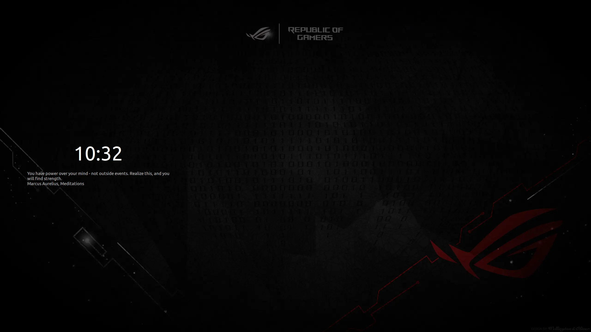

# Linux screensaver quote updater
A script made for Cinnamon desktop environment that can be used for updating lock screen messages with random quotes from JSON file.
The script code can be updated easily to support other environments. 



# Requierments

Python

nemo_actions_and_cinnamon_scripts are optional.

# Installation
Clone git repo to the installation folder and add "lock_screen_updater" to the startup scripts. 
In that way, the quotes will be updated every startup. 

The script can be called with login/logout or lock/unlock event and in that way, quotes will be updated more frequently.
Here is an eximple how to achive this with slideshow script from nemo_actions_and_cinnamon_scripts: 

Clone the repo to your drive:
```
git clone https://github.com/smurphos/nemo_actions_and_cinnamon_scripts
```

Install the script and to autostart:
```
mkdir -p ~/.local/bin

cp -r ./nemo_actions_and_cinnamon_scripts/.local/bin/lock_screen_slideshow.sh ~/.local/bin

cp -r ./nemo_actions_and_cinnamon_scripts/.config/autostart/lock_screen_slideshow.desktop ~/.config/autostart
```

Edit slideshow script:
```
xdg-open ~/.local/bin/lock_screen_slideshow.sh
```

Add script call as I did in line 108:
```
else
  # Set background back to the user background and unpause native slideshow on screensaver de-activation
    if ( $ACTIVE ) ; then
      gsettings set org.cinnamon.desktop.background picture-options "$DESK_MODE"
      if ( $NATIVE_SLIDESHOW_STATE ) ; then
        gsettings set org.cinnamon.desktop.background.slideshow slideshow-enabled "$NATIVE_SLIDESHOW_STATE"
      else
        gsettings set org.cinnamon.desktop.background picture-uri "$DESK_BACKGROUND"
      fi
      ACTIVE=false
     ->  # Update lock screen quote
     ->  ~/.scripts/lock_screen_updater/lock_screen_updater.sh
    fi
  fi
done
```

If scrypt won't run, add execution permission with: 
```
chmod +x lock_screen_updater
```

